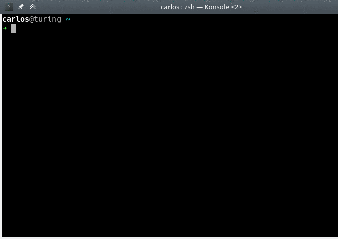

# checkpkgs

Check for Arch Linux packages updates given from arguments or **stdin** with no need to update the local repositories. Not installed and fake packages can also be checked.

By default, it doesn't look for updates in testing repositories, but you can do it using global variables as it is shown in the following section.

```
$ checkpkgs [package, ...] [options]
```



## Examples

* Look for updates of given packages.
```
$ checkpkgs foo bar
```

* Look for updates of given packages with ordered output.
```
$ checkpkgs foo bar --ordered
```

* Look for updates of given packages from **stdin**.
```
$ cat ~/important-packages.log | checkpkgs
```

* Look for them also in Community-Testing, Multilib-Testing and Testing.
```
$ COMMUNITY_TESTING=1 MULTILIB_TESTING=1 TESTING=1 checkpkgs foo bar
```

## Installation

You can install this package via the [AUR](https://aur.archlinux.org/packages/checkpkgs/).

## Contact

If you have any problem you can open an issue or email me at carmilso@upv.es.

---

[LICENSE](./LICENSE)
